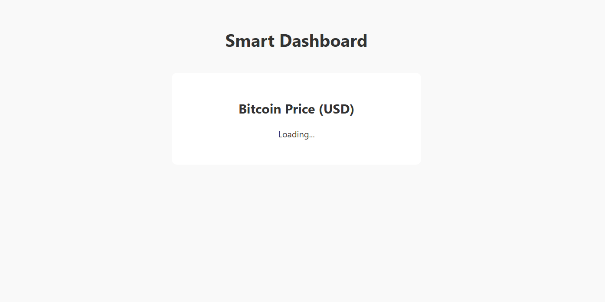

# 📊 Smart Dashboard

A clean and responsive React dashboard that fetches live Bitcoin price data from an API.  
Includes Dark Mode toggle and card-based layout.

---

## 🚀 Features

- ⚡ Fast and lightweight
- 🌙 Dark Mode toggle
- 📡 Live data via public API
- 💡 Easy to customize components
- 📱 Mobile responsive

---

## 🛠 Built With

- React (Vite)
- Fetch API
- Custom CSS (no frameworks)

---

## ▶️ Live Demo

🌍 [Open live version]([https://dein-netlify-link.netlify.app](https://680794773485fddb058e3e56--remarkable-shortbread-2a3b6d.netlify.app/))



---

## 📦 Getting Started (Local)

```bash
git clone https://github.com/gricciardi/smart-dashboard.git
cd smart-dashboard
npm install
npm run dev
